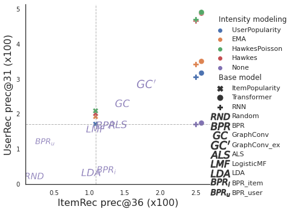
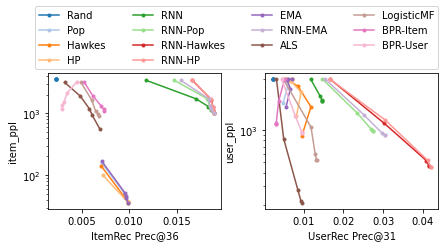

## Recurrent Intensity Model Experiments


Repository to reproduce the experiments in these papers:

[Bridging Recommendation and Marketing via Recurrent Intensity Modeling. ICLR 2022.](https://openreview.net/forum?id=TZeArecH2Nf)
```
@inproceedings{ma2022bridging,
    title={Bridging Recommendation and Marketing via Recurrent Intensity Modeling},
    author={Yifei Ma and Ge Liu and Anoop Deoras},
    booktitle={International Conference on Learning Representations},
    year={2022},
    url={https://openreview.net/forum?id=TZeArecH2Nf}
}
```

[Recurrent Intensity Modeling for User Recommendation and Online Matching](http://roseyu.com/time-series-workshop/submissions/2021/TSW-ICML2021_paper_47.pdf);
[(Amazon Link)](https://www.amazon.science/publications/recurrent-intensity-modeling-for-user-recommendation-and-online-matching)

```
@inproceedings{ma2021recurrent,
    Author = {Ma, Yifei and Liu, Ge and Deoras, Anoop},
    Booktitle = {ICML Time Series Workshop},
    Title = {Recurrent Intensity Modeling for User Recommendation and Online Matching},
    Year = {2021}
}
```

## Getting Started

1. Download and install via `pip install -e .`
    - If you see "RuntimeError: Unable to find target ...", try `pip install --no-cache-dir --ignore-installed -U numba`
    - Some baseline models may require manual installation. They are optional.
    - <details>
        <summary>To install everything:</summary>

        ```
        !pip install -e .
        !pip install --no-cache-dir --ignore-installed -U numba  # optional fix for numba error
        !pip install dgl-cu111  # replace with the correct cuda version
        !conda install -c conda-forge implicit implicit-proc=*=gpu -y
        # restart kernel after installation
        %run test/test_rime.py
        test_minimal_dataset()
        ```
    </details>

2. Add data to the [data](data) folder. Some downloading and preparing scripts may be found in [data/util.py](data/util.py).
3. Run recommendation experiment as
    ```
    import rime
    D, V, *V_extra = rime.dataset.prepare_ml_1m_data(exclude_train=True)
    self = rime.Experiment(D, V, *V_extra)
    self.run()
    self.print_results()  # tabular results
    fig = rime.util.plot_rec_results(self, 'prec')
    ```

    

    Notice the optional config that excludes training user-item pairs from reappearing in predictions (and targets) by automatically generating a prior_score attribute in dataset class. This helps non-temporal matrix-factorization models.

4. Run matching experiment with Dual-Online allocation and plot diversity-relevance trade-off
   ```
   online = rime.Experiment(D, V, *V_extra,
                            mult=[0, 0.3, 0.7, 1, 3, 10, 200],  # turn on match calculation
                            online=True)  # optional; default offline = greedy match
   online.run(["Rand", "Pop", "HP", "ALS", "BPR", "GraphConv-Extra",
                   "Transformer", "Transformer-Pop", "Transformer-HP",])
   online.print_results()  # tabular results
   fig = rime.util.plot_mtch_results(online)
   ```

    

5. Run `pytest -s -x --pdb` for unit tests including the end-to-end workflow.

## Code Organization

**Step 0. Data Preparation**

The simplest way to prepare data is via `create_dataset_unbiased` function:
```
rime.dataset.base.create_dataset_unbiased(
    event_df: pd.DataFrame(columns=['USER_ID', 'ITEM_ID', 'TIMESTAMP']),
    user_df: pd.DataFrame(columns=['TEST_START_TIME'], index=USER_ID),
    item_df: pd.DataFrame(index=ITEM_ID),
    horizon = float('inf'))  # test period relative to TEST_START_TIME
```

<details>
    <summary>General definitions</summary>

This function (and the resulting `Dataset` class) allow for multiple data splitting methods, including by user, by absolute time, and by relative percentage per user event stream. Our trick is to ask for a table of all events in `event_df` and a table of all users in `user_df` with one `TEST_START_TIME` per row. The function will then extract training events based on `TIMESTAMP < TEST_START_TIME` and testing events between `TEST_START_TIME <= TIMESTAMP < TEST_START_TIME + horizon`, respectively for each user. To improve clarity, we also require all items to be registered in `item_df`. Finally, in `user_df` table, we have special logics if we see multiple rows with the same `USER_ID` index but different `TEST_START_TIME` per user. We consider this as a desire to evaluate the models for rolling next-item predictions, regular-interval updates, etc., as the input suggests.

Besides the basic splitting logic, `create_dataset_unbiased` includes a few default options. We default to filtering user-and-item test candidates by `min_user_len>=1`, `min_item_len>=1`, and `TEST_START_TIME<inf`. This is to avoid evaluation biases against cold-start users and items and the thresholds may be adjusted if bias is not a concern. We also set `exclude_train=True` to automatically exclude the training events from appearing as testing targets. In the same context, we generate a sparse `prior_score` matrix that can be added to the model prediction outputs to discourage the models from repetitive predictions as well. See `rime.dataset.__init__.prepare_minimal_dataset` for some examples including these special cases.

For the `rime.Experiment` class to run, we need at least one dataset `D` for testing and auto-regressive training. We may optionally provide validating datasets `V` and `*V_extra` based on earlier time splits or user splits. The first validating dataset is used in the calibration of `Dual-Online` in Step 3 with the `online=True` option. All validating datasets are used by time-bucketed models (`GraphConv` and `HawkesPoisson`). Some models may be disabled if relevant data is missing.

</details>

<details>
    <summary>Examples</summary>

In the following examples, we will use the same `event_df` and `item_df`. Also, please notice that the argument order is different between `Dataset` and `create_dataset_unbiased`.

```
event_df = pd.DataFrame([('u1', 'a', 3), ('u1', 'b', 4), ('u2', 'c', 5), ('u2', 'd', 6)],
                        columns=['USER_ID', 'ITEM_ID', 'TIMESTAMP'])
item_df = pd.DataFrame(index=['a', 'b', 'c', 'd'])
```

1. Temporal seq2seq split for `{u1: [a, b]->[], u2: [c]->[d]}`
    ```
    user_df = pd.Series({'u1': 6, 'u2': 6}).to_frame("TEST_START_TIME")
    D = rime.dataset.Dataset(user_df, item_df, event_df)
    ```

2. User-based split, training on `{u1: [a, b], u2: [c]}` and testing on `{u2: [c] -> [d]}`
    ```
    user_df = pd.Series({'u1': float('inf'), 'u2': 6}).to_frame("TEST_START_TIME")
    D = rime.dataset.create_dataset_unbiased(event_df, user_df, item_df, min_item_len=0)
    ```

3. Rolling prediction, training on `{u1: [a, b]}` and testing on `{(u2, 5): [] -> [c], (u2, 6) [c] -> [d]}`
    ```
    user_df = pd.Series({'u1': float('inf'), 'u2': float('-inf')}).to_frame("TEST_START_TIME")
    test_requests = pd.DataFrame(index=pd.MultiIndex.from_tuples([('u2', 5), ('u2', 6)]))
    D = rime.dataset.Dataset(user_df, item_df, event_df, test_requests=test_requests, horizon=1)
    ```
</details>

**Step 1. Predictions**

Let `x` be a user-time state and `y` be a unique item. Traditional top-k item-recommendation aims to predict `p(y|x)` for the next item given the current user-state. On the other hand, we introduce symmetry via user-recommendation that allows for the comparisons across `x`. To this end, we novelly redefine the problem as the prediction of user-item engagement *intensities* in a unit time window in the immediate future, `λ(x,y)`, and utilize a marked temporal point process (MTPP) decomposition as `λ(x,y) = λ(x) p(y|x)`. Here is the code to do that:
```
rnn = rime.models.rnn.RNN(**self.model_hyps["RNN"]).fit(D.auto_regressive)
hawkes = rime.models.hawkes.Hawkes(D.horizon).fit(D.auto_regressive)
S = rnn.transform(D) * hawkes.transform(D)
```
S is a low-rank dataframe-like object with shape `(len(D.user_in_test), len(D.item_in_test))`.

**Step 2. Offline decisions**

Ranking of the items (or users) and then comparing with the ground-truth targets can be laborsome. Instead, we utilize the `scipy.sparse` library to easily calculate the recommendation `hit` rates through point-wise multiplication. The sparsity property allows the evaluations to scale to large numbers of user-item pairs.
```
item_rec_assignments = rime.util._assign_topk(S, item_rec_topk, device='cuda')
item_rec_metrics = evaluate_assigned(D.target_csr, item_rec_assignments, axis=1, device='cuda')
user_rec_assignments = rime.util._assign_topk(S.T, user_rec_C, device='cuda').T
user_rec_metrics = evaluate_assigned(D.target_csr, user_rec_assignments, axis=0, device='cuda')
```

**Step 3. Online simulation**

RIME contains an optional configuration *"Dual-Online"*, which simulates a scenario where we may not observe the full set of users ahead of time, but must make real-time decisions immediately and unregretfully as each user arrives one at a time.
This scenario is useful in the case of multi-day marketing campaigns with budgets allocated for the long-term prospects.
Our basic idea is to approximate a quantile threshold `v(y)` per item-y from an observable user sample and then generalize it to the testing set.
We pick the user sample from a "validation" data split `V`.
Additionally, we align the item_in_test between D and V, because Dual also considers the competitions for the limited user capacities from different items.
```
V = V.reindex(D.item_in_test.index, axis=1) # align on the item_in_test to generalize
T = rnn.transform(V) * hawkes.transform(V)  # solve Dual based on the validation set
dual = rime.metrics.dual.Dual(S, item_rec_topk, user_rec_C, ...) # set hyperparameters
dual_assigned = dual.fit(T).transform(S)
out = evaluate_assigned(D.target_csr, dual_assigned, axis=0)
```

Dual-Online is integrated as `self.metrics_update("RNN-Hawkes", S, T)`,
when `self.online=True` and `T is not None`.

**Misc**

More information may be found in auto-generated documentation at [ReadTheDocs](https://recurrent-intensity-model-experiments.readthedocs.io/).
The main functions are covered in [test](test).


## Security

See [CONTRIBUTING](CONTRIBUTING.md#security-issue-notifications) for more information.

## License

This project is licensed under the Apache-2.0 License.

