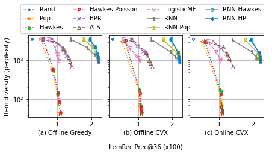

## Recurrent Intensity Model Experiments


Repository to reproduce the experiments in the paper:

[Recurrent Intensity Modeling for User Recommendation and Online Matching](http://roseyu.com/time-series-workshop/submissions/2021/TSW-ICML2021_paper_47.pdf);
[(Another Link)](https://www.amazon.science/publications/recurrent-intensity-modeling-for-user-recommendation-and-online-matching)

```
@inproceedings{ma2021recurrent,
    Author = {Ma, Yifei and Liu, Ge and Deoras, Anoop},
    Booktitle = {ICML Time Series Workshop},
    Title = {Recurrent Intensity Modeling for User Recommendation and Online Matching},
    Year = {2021}
}
```

## Getting Started

1. Download and install via `pip install -e .`
    - If direct installation fails, some dependencies might be more easily installed by conda: `conda env update --file environment.yml --name target-env-to-update`
    - Package implicit requires separate installation: `conda install -c conda-forge implicit implicit-proc=*=gpu -y`
    - Notice: conda env update may overwrite the current python version and it is recommended to manually fix that in the yml file.
2. Add data to the [data](data) folder. Some downloading and preparing scripts may be found in [data/util.py](data/util.py).
3. Run experiment as
    ```
    from rime import main, plot_results, Experiment, evaluate_assigned
    self = main("prepare_ml_1m_data") # or "prepare_minimal_dataset"
    # print out item_rec and user_rec metrics for all included methods
    ```
4. Run `pytest -s -x --pdb` for unit tests including the end-to-end workflow.

## More Examples

Perform Offline-Greedy optimization for diversity-relevance trade-offs
```
mult=[0, 0.1, 0.2, 0.5, 1, 3, 10, 30, 100]
self = main("prepare_ml_1m_data", mult=mult)
fig = plot_results(self)
```


Perform CVX-Online allocation for diversity-relevance trade-offs
```
cvx_online = main("prepare_ml_1m_data", mult=mult, cvx=True, online=True)
fig = plot_results(cvx_online)
```


Optional configuration that excludes training user-item pairs from reappearing in predictions and targets by a large penalization prior. For other types of block (or approval) lists, please provide a negative (or positive) `prior_score` input to `Dataset` constructor following the source code of this example.
```
D, V = rime.dataset.prepare_ml_1m_data(exclude_train=True)
self = Experiment(D, V)
self.run()
self.print_results()
```

With the `exclude-train` option, the performances of ALS, BPR, and LogisticMF improve significantly. (Plot generated from modified scripts/everything_ml_1m.py)



## Code Organization

Here is the content of the `main` function:
```
D, V = prepare_some_dataset(...) # output instances of rime.dataset.base.Dataset
self = rime.Experiemnt(D, V, ...) # V is required only for Hawkes-Poisson and CVX-Online.
self.run()
self.results.print_results()
```

Here is what `Experiment.run` basically does:

**Step 1. Predictions.**

Let `x` be a user-time state and `y` be a unique item. Traditional top-k item-recommendation aims to predict `p(y|x)` for the next item given the current user-state. On the other hand, we introduce symmetry via user-recommendation that allows for the comparisons across `x`. To this end, we novelly redefine the problem as the prediction of user-item engagement *intensities* in a unit time window in the immediate future, `λ(x,y)`, and utilize a marked temporal point process (MTPP) decomposition as `λ(x,y) = λ(x) p(y|x)`. Here is the code to do that:
```
rnn = rime.models.rnn.RNN(**self.model_hyps["RNN"]).fit(D.training_data)
hawkes = rime.models.hawkes.Hawkes(D.horizon).fit(D.training_data)
S = rnn.transform(D) * hawkes.transform(D)
```
S is a low-rank dataframe-like object with shape `(len(D.user_in_test), len(D.item_in_test))`.

**Step 2. Offline decisions.**

Ranking of the items (or users) and then comparing with the ground-truth targets can be laborsome. Instead, we utilize the `scipy.sparse` library to easily calculate the recommendation `hit` rates through point-wise multiplication. The sparsity property allows the evaluations to scale to large numbers of user-item pairs.
```
item_rec_assignments = rime.util._assign_topk(score_mat, item_rec_topk, device='cuda')
item_rec_metrics = evaluate_assigned(D.target_csr, item_rec_assignments, axis=1)
user_rec_assignments = rime.util._assign_topk(score_mat.T, user_rec_C, device='cuda').T
user_rec_metrics = evaluate_assigned(D.target_csr, user_rec_assignments, axis=0)
```

**Step 3. Online simulation.**

RIME contains an optional configuration *"CVX-Online"*, which simulates a scenario where we may not observe the full set of users ahead of time, but must make real-time decisions immediately and unregretfully as each user arrives one at a time.
This scenario is useful in the case of multi-day marketing campaigns with budgets allocated for the long-term prospects.
Our basic idea is to approximate a quantile threshold `v(y)` per item-y from an observable user sample and then generalize it to the testing set.
We pick the user sample from a "validation" data split `V`.
Additionally, we align the item_in_test between D and V, because cvx also considers the competitions for the limited user capacities from different items.
```
V = V.reindex(D.item_in_test.index, axis=1) # align on the item_in_test to generalize
T = rnn.transform(V) * hawkes.transform(V)  # solve CVX based on the predicted scores.
cvx_online = rime.metrics.cvx.CVX(S, item_rec_topk, user_rec_C, ...) # set hyperparameters
online_assignments = cvx_online.fit(T).transform(S)
out = evaluate_assigned(D.target_csr, online_assignments, axis=0)
```

CVX-Online is integrated as `self.metrics_update("RNN-Hawkes", S, T)`,
when `self.online=True` and `T is not None`.

More information may be found in auto-generated documentation at [ReadTheDocs](https://recurrent-intensity-model-experiments.readthedocs.io/).
To extend to other datasets, one may follow the [two examples](src/rime/dataset/__init__.py) to create a minimal Dataset instance as:
```
D = rime.dataset.Dataset(
    target_csr=..., user_in_test=..., item_in_test=...,
    training_data=argparse.Namespace(event_df=..., user_df=..., item_df=...),
    # optional sparse negative prior for exclusions or positive prior for approvals
    ...)
```
The main functions are covered in [test](test).


## Security

See [CONTRIBUTING](CONTRIBUTING.md#security-issue-notifications) for more information.

## License

This project is licensed under the Apache-2.0 License.

