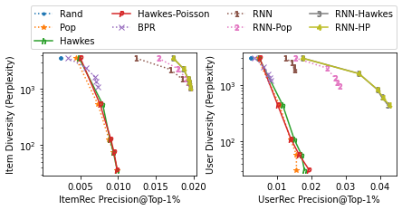

## Recurrent Intensity Model Experiments


Repository to reproduce the experiments in the paper:

Yifei Ma, Ge Liu Anoop Deoras. Recurrent Intensity Modeling for User Recommendation and Online Matching. ICML 2021 Time-Series Workshop.
[link1](http://roseyu.com/time-series-workshop/submissions/2021/TSW-ICML2021_paper_47.pdf)
[link2](https://www.amazon.science/publications/recurrent-intensity-modeling-for-user-recommendation-and-online-matching)


## Getting Started

1. Download and install via `pip install -e .` Additional conda dependencies may be found at [environment.yml](environment.yml)
2. Add in [data](data) folder. See detailed instructions therein.
3. Run experiment as
    ```
    from rim_experiments import main, plot_results
    self = main("prepare_ml_1m_data", lb_mult=[0.5, 0.2, 0.1, 0])
    fig = plot_results(self)
    ```
    
4. To extend to other datasets, see example in [prepare_synthetic_data](src/rim_experiments/dataset/__init__.py)
5. The provided examples are tested in [test](test).


## Security

See [CONTRIBUTING](CONTRIBUTING.md#security-issue-notifications) for more information.

## License

This project is licensed under the Apache-2.0 License.

