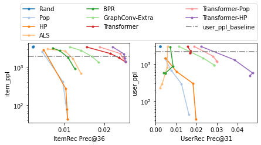

## Recurrent Intensity Model Experiments


This package reproduces the experiments in the referenced papers at the bottom of the page.
In the papers, we expand the idea of "implicit-feedback recommender systems" to "implicit-feedback marketing systems" and demonstrate some benefits in improving the circulation of new items - a classical problem called item cold-start.

Imagine an implicit-feedback recommender system to be solving the probabilistic distribution of `p(y|x)`,
where `x` is the current state of a user based on all historical items that the user has consumed and
`y` is the next item to recommend.
Our first contribution is to address the reverse direction using marked temporal point processes, `λ(x|y)∝p(y|x)λ(x)`, where we predict the affinity of a user to an item at a given time with the novel *intensity* function `λ`.

Besides predicting the affinity or intensity scores, we further discuss how to integrate marketing ideas into organic recommendation to improve item cold-start performance.
Our key challenge is that we can only recommend the promotional (cold-start) items when a user appears online in the RecSys, which is a random event in itself.
To meet the challenge, we record the distribution of all user states as they appear online during a past time period and then solve for the "Dual" variables `v(y)` for each and every item `y`.
Then, we show that we only need to rerank the recommendations by the modified scores, `λ(x,y)-v(y)` for the same user `x` in real time, to ensure that we can cumulatively deliver item `y` to a desired number of all user visits in a future time period.
Our strategy is analogous to finding an empirical threshold `v(y)` and picking users only when their scores exceed the threshold.
However, our analysis is more fundamental and we also consider the competing delivery guarantees for multiple items at the same time.
The multiple-item scenario is applicable in the item cold-start problem, which we show in our experiments.


## Getting Started

1. Download and install via `pip install -e .`
    - If you see "RuntimeError: Unable to find target ...", try `pip install --no-cache-dir --ignore-installed -U numba`
    - Some baseline models may require manual installation. They are optional.
    - <details>
        <summary>To install everything:</summary>

        ```
        !pip install -e .
        !pip install --no-cache-dir --ignore-installed -U numba  # optional fix for numba error
        !pip install dgl-cu111  # replace with the correct cuda version
        !conda install -c conda-forge implicit implicit-proc=*=gpu -y
        # restart kernel after installation
        %run test/test_rime.py
        test_minimal_dataset()
        ```
    </details>

2. Add data to the [data](data) folder. Some downloading and preparing scripts may be found in [data/util.py](data/util.py).
3. Run recommendation experiment as
    ```
    import rime
    D, V, *V_extra = rime.dataset.prepare_ml_1m_data(exclude_train=True)
    self = rime.Experiment(D, V, *V_extra)
    self.run()
    self.print_results()  # tabular results
    fig = rime.util.plot_rec_results(self, 'prec')
    ```

    

    Notice the optional config that excludes training user-item pairs from reappearing in predictions (and targets) by automatically generating a prior_score attribute in dataset class. This helps non-temporal matrix-factorization models.

4. Run matching experiment with Dual-Online allocation and plot diversity-relevance trade-off
   ```
   online = rime.Experiment(D, V, *V_extra,
                            mult=[0, 0.3, 0.7, 1, 3, 10, 200],  # turn on match calculation
                            online=True)  # optional; default offline = greedy match
   online.run(["Rand", "Pop", "HP", "ALS", "BPR", "GraphConv-Extra",
                   "Transformer", "Transformer-Pop", "Transformer-HP",])
   online.print_results()  # tabular results
   fig = rime.util.plot_mtch_results(online)
   ```

    

5. Run `pytest -s -x --pdb` for unit tests including the end-to-end workflow.

## Code Organization

**Step 0. Data Preparation**


We use a `Dataset` class to represent the train/test split for evaluation in both recommendation and marketing scenarios.
In the simplest form, the test labels are represented as a sparse matrix `target_csr` between all users and items for a time period `[T, T + horizon)`, shown on the left side of the figure.
The training data is automatically extracted from the corresponding user events prior to time `T` and the user histories also serve as user-side features in the testing phase.

On the right side of the figure, we introduce some useful extensions.
Notably, we allow each user to contain multiple (or zero) `TEST_START_TIME`.
To separate from the globally unique `user_df`, we call these different temporal states `test_requests` or `user_in_test`.
We also have a `item_in_test` attribute, but it is for a different purpose which we will discuss in the next paragraph.
For now, we only consider stateless items and accumulate all user interactions within their respective time periods.

Optionally, we introduce a `create_dataset_unbiased` function which further eliminates test users and items that have not been previously seen at training time. Unless specified explicitly, `user_in_test` is automatically extracted from all seen users with test-start time < ∞. Likewise, `item_in_test` corresponds to the seen items from the histories of the all unique users.

For the `rime.Experiment` class to run, we need at least one dataset `D` for testing and auto-regressive training. We may optionally provide validating datasets `V` and `*V_extra` based on earlier time splits or user splits. The first validating dataset is used in the calibration of `Dual-Online` in Step 3 with the `online=True` option. All validating datasets are used by time-bucketed models (`GraphConv` and `HawkesPoisson`). Some models may be disabled if relevant data is missing.


<details>
    <summary>Expand this tab for some examples</summary>

In the following examples, we will use the same `event_df` and `item_df`.

```
event_df = pd.DataFrame([('u1', 'a', 3),
                         ('u1', 'b', 4),
                         ('u2', 'c', 5),
                         ('u2', 'd', 6)],
                        columns=['USER_ID', 'ITEM_ID', 'TIMESTAMP'])
item_df = pd.DataFrame(index=['a', 'b', 'c', 'd'])
```

1. Temporal seq2seq split
    ```
    user_df = pd.Series({'u1': 6, 'u2': 6}).to_frame("TEST_START_TIME")
    D = rime.dataset.Dataset(user_df, item_df, event_df)
    # The result is a training set of {u1: [a, b], u2: [c]} and a testing set of {u1: [], u2: [d]}
    ```

2. User-based split
    ```
    user_df = pd.Series({'u1': float('inf'), 'u2': 6}).to_frame("TEST_START_TIME")
    D = rime.dataset.create_dataset_unbiased(event_df, user_df, item_df, min_item_len=0)
    # Notice that the argument order is different between Dataset and create_dataset_unbiased
    # The result is a training set of {u1: [a, b], u2: [c]} and a testing set of {u2: [d]}
    ```

3. Rolling prediction
    ```
    user_df = pd.Series({'u1': float('inf'), 'u2': float('-inf')}).to_frame("TEST_START_TIME")
    test_requests = pd.DataFrame(index=pd.MultiIndex.from_tuples([('u2', 5), ('u2', 6)]))
    D = rime.dataset.Dataset(user_df, item_df, event_df, test_requests=test_requests, horizon=1)
    # The result is a training set of {u1: [a, b]} and a testing set of
    #    {(u2, 5): [] -> [c],
    #     (u2, 6): [c] -> [d]}
    ```

Finally, please notice that the argument order is different between `Dataset` and `create_dataset_unbiased`.
</details>

**Step 1. Predictions**

Let `x` be a user-time state and `y` be a unique item. Traditional top-k item-recommendation aims to predict `p(y|x)` for the next item given the current user-state. On the other hand, we introduce symmetry via user-recommendation that allows for the comparisons across `x`. To this end, we novelly redefine the problem as the prediction of user-item engagement *intensities* in a unit time window in the immediate future, `λ(x,y)`, and utilize a marked temporal point process (MTPP) decomposition as `λ(x,y) = λ(x) p(y|x)`. Here is the code to do that:
```
rnn = rime.models.rnn.RNN(**self.model_hyps["RNN"]).fit(D.auto_regressive)
hawkes = rime.models.hawkes.Hawkes(D.horizon).fit(D.auto_regressive)
S = rnn.transform(D) * hawkes.transform(D)
```
S is a low-rank dataframe-like object with shape `(len(D.user_in_test), len(D.item_in_test))`.

**Step 2. Offline decisions**

Ranking of the items (or users) and then comparing with the ground-truth targets can be laborsome. Instead, we utilize the `scipy.sparse` library to easily calculate the recommendation `hit` rates through point-wise multiplication. The sparsity property allows the evaluations to scale to large numbers of user-item pairs.
```
item_rec_assignments = rime.util._assign_topk(S, item_rec_topk, device='cuda')
item_rec_metrics = evaluate_assigned(D.target_csr, item_rec_assignments, axis=1, device='cuda')
user_rec_assignments = rime.util._assign_topk(S.T, user_rec_C, device='cuda').T
user_rec_metrics = evaluate_assigned(D.target_csr, user_rec_assignments, axis=0, device='cuda')
```

**Step 3. Online simulation**

RIME contains an optional configuration *"Dual-Online"*, which simulates a scenario where we may not observe the full set of users ahead of time, but must make real-time decisions immediately and unregretfully as each user arrives one at a time.
This scenario is useful in the case of multi-day marketing campaigns with budgets allocated for the long-term prospects.
Our basic idea is to approximate a quantile threshold `v(y)` per item-y from an observable user sample and then generalize it to the testing set.
We pick the user sample from a "validation" data split `V`.
Additionally, we align the item_in_test between D and V, because Dual also considers the competitions for the limited user capacities from different items.
```
V = V.reindex(D.item_in_test.index, axis=1) # align on the item_in_test to generalize
T = rnn.transform(V) * hawkes.transform(V)  # solve Dual based on the validation set
dual = rime.metrics.dual.Dual(S, item_rec_topk, user_rec_C, ...) # set hyperparameters
dual_assigned = dual.fit(T).transform(S)
out = evaluate_assigned(D.target_csr, dual_assigned, axis=0)
```

Dual-Online is integrated as `self.metrics_update("RNN-Hawkes", S, T)`,
when `self.online=True` and `T is not None`.

**Misc**

More information may be found in auto-generated documentation at [ReadTheDocs](https://recurrent-intensity-model-experiments.readthedocs.io/).
The main functions are covered in [test](test).


## Security

See [CONTRIBUTING](CONTRIBUTING.md#security-issue-notifications) for more information.

## License

This project is licensed under the Apache-2.0 License.

## References


[Bridging Recommendation and Marketing via Recurrent Intensity Modeling. ICLR 2022.](https://openreview.net/forum?id=TZeArecH2Nf)
```
@inproceedings{ma2022bridging,
    title={Bridging Recommendation and Marketing via Recurrent Intensity Modeling},
    author={Yifei Ma and Ge Liu and Anoop Deoras},
    booktitle={International Conference on Learning Representations},
    year={2022},
    url={https://openreview.net/forum?id=TZeArecH2Nf}
}
```

[Recurrent Intensity Modeling for User Recommendation and Online Matching](http://roseyu.com/time-series-workshop/submissions/2021/TSW-ICML2021_paper_47.pdf);
[(Amazon Link)](https://www.amazon.science/publications/recurrent-intensity-modeling-for-user-recommendation-and-online-matching)

```
@inproceedings{ma2021recurrent,
    Author = {Ma, Yifei and Liu, Ge and Deoras, Anoop},
    Booktitle = {ICML Time Series Workshop},
    Title = {Recurrent Intensity Modeling for User Recommendation and Online Matching},
    Year = {2021}
}
```
